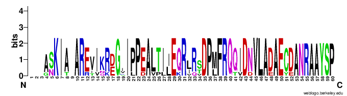

# PSSM-Distil
The paper "PSSM-Distil: Protein Secondary Structure Prediction (PSSP) on Low-QualityPSSM by Knowledge Distillation with Contrastive Learning" of AAAI21 Conference

> Requirement
>
>
    pip install torch
    pip install glob
    pip install tqdm
    pip install numpy

> Instructions

    python inference_real.py
    
Aboving command will predict secondary structure for a sequence in 'sequences' folder with a pssm in 'low_pssm' folder and print the accuracy.

    python inference_our.py
    
Aboving command will predict secondary structure of sequence in 'sequences' folder with enhanced pssm which refined by PSSM-Distil and print the accuracy. 
Besides, this command will save an enhanced pssm file in 'enhanced_pssms' folder.

    python sample_msa_from_pssm.py ./enhanced_pssms/4ynhA.npy
    
Aboving command will sample 2000 MSAs from enhanced PSSM and save in a3ms folder as '4ynhA_enhanced_pssms.a3m'.

> Visualization

Please upload original low-quality .a3m file and the enhanced one in 'a3ms' folder to the website: https://weblogo.berkeley.edu/logo.cgi respectively.
Then you will see such comparison images.

> BC40 dataset

https://drive.google.com/drive/folders/15vwRo_OjAkhhwfjDk6-YoKGf4JzZXIMC?usp=sharing

The dataset we released to examine the performance of PSSM-Distil

